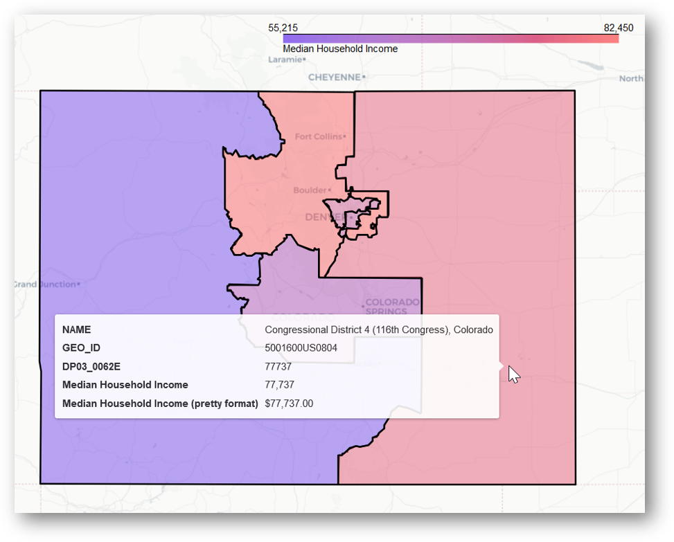

# BBD: Bluebonnet Data Library

**BBD** is a library for helping teams perform political campaign data analysis.


[](https://badge.fury.io/py/bbd)

## Installing BBD

BBD is available on PyPI:

```console
python -m pip install bbd
```

## Example

For a running start, you can copy the [examples](examples/) folder to your machine and run the example python scripts to map median household income per census tract in Larimer county, Colorado (among other things).

## Walkthrough

Follow along with this walkthrough to learn more detailed infomation about using this library.

### Getting Census Data
First, find the data you want to visualize. This is often easiest through the census API, and the next bit of text will read a bit like a "How to Get Census Data" tutorial.

For our working example, we'll use median household income (which is coded in the census data as as "DP03_0062E").

We can simply downloaded the census data like so:

```python
>>> from bbd import census
>>> data = census.get_acs(
>>>    geography=census.Geography.CD,
>>>    variables="group(DP03),NAME",
>>>    year=2018,
>>>    state="co",
>>>    dataset=census.DataSets.ACS5_PROFILE,
>>> )
```

    https://api.census.gov/data/2018/acs/acs1/profile?get=group(DP03),NAME&for=congressional%20district:*&in=state:08

For more information on how to come up with your own census API requests I'd highly recommend the first 6 minutes of [this video](https://www.census.gov/library/video/2020/using-api-all-results-for-acs-table.html). Or, you could simply [start browsing census data sets](https://www.census.gov/data/developers/data-sets.html). For reference, the following table describes the basic elements of the API call used to get this working example's data.

| URL Part               | Meaning
| ----------------       |-------------
| get=group(DP03)        | Data columns include those in group DP03 (economics)
| ,NAME                  | Include name of each entity, just a nicety
| for=congr...district:* | One row for each congressional district
| in=state:08            | Only get rows for state 08 (Colorado)

This census data is stored more or less as a big table in json format:

```python
[
    ["NAME", "GEO_ID", "DP03_0001E", ...] # Headers
    ["Congressional District 1", "5001600US0801", "693303", ...] # Data
    ["Congressional District 2", "5001600US0802", "672976", ...] # Data
    ["...", "...", "...", ...] # Data
]
```

When you request it from the API with `get_acs`, it is automatically converted to a format that is plottable and join-able with shapefiles. If you downloaded the file manually and want to convert it yourself, you can use `census.load_json_file`.

```python
>>> print(data)
{
    "NAME": ["Congressional District 1", "Congressional District 2", ...],
    "GEO_ID": ["5001600US0801", "5001600US0802", ...]
    "DP03_0001E": ["693303", "672976", ...]
}
```

### Getting Shapefiles

Luckily, the census provides shapefiles for pretty much every `GEO_ID` you can find in the census API. You can automatically download them like this:

```python
>>> shapefile_path = census.get_shapefile(
>>>     geography=census.Geography.CD,
>>>     state="co",
>>>     year=2018,
>>>     cache=True,
>>> )
```

To get these files manually, just head to [this website](https://www.census.gov/cgi-bin/geo/shapefiles/index.php) and select the relevent geography/location.

### Match Census Data GEO ID to Shapefile GEO ID

I happen to know that the GEO_ID in the shapefile is stored under the key "GEOID", and is only 4 digits long. There are reasons for this [described here](https://www.census.gov/programs-surveys/geography/guidance/geo-identifiers.html), but all we need to do is make an entry for our census data that matches the shapefile.

```python
>>> data["GEOID"] = [geoid[-4:] for geoid in data["GEO_ID"]]
```

To determine how many digits you need for your own shapefile, I'd recommend just taking a quick look with [PyShp](https://pypi.org/project/pyshp/).

```console
python -m pip install pyshp
```

```python
>>> import shapefile
>>> 
>>> # What is the name of the GEO ID field?
>>> shp = shapefile.Reader(shapefile_path)
>>> shp.fields
[
    ["GEOID", "C", 4, 0], # Cool! Name of GEO ID field is "GEOID"
    ["ALAND", "N", 14, 0],
    ["AWATER", "N", 14, 0], 
    [...],
]
>>>
>>> # Now we need to see how many digits long the GEO ID is.
>>> for record in shp.records():
>>>     print(record["GEOID"])
0801
0803
0805
...
>>> # Looks like 4 digits it is!
```

You can also of course simply view the property table in your favorite GIS software (e.g. [the free QGIS](https://qgis.org/en/site/forusers/download.html)).

### Create Data to Color By

The only thing better than a map is a map with color. You know the saying. The column to color by must be numeric.

```python
>>> # Note: the name of this entry will be used as the text caption on the colormap
>>> data["Median Household Income"] = [float(x) for x in data["DP03_0062E"]]
```

### Create Nicely Formatted String for ToolTip

We also want our map to have nice interactive tooltips so that you can see information about each shape by hovering over it with your mouse! To visualize the income, I'll just add comma separators and a $ sign.

```python
>>> data["Median HouseHold Income (pretty format)"] = [
>>>     "${:,.2f}".format(x) for x in data["Median Household Income"]
>>> ]
```

### Create Map!

Finally, we can create the leaflet map and save it to our machine.

```python
>>> geojson_map = gis.make_map(
>>>     shapefile_path,
>>>     data,
>>>     join_on="GEOID", # Common field between shapefile and our census data 
>>>     color_by="Median Household Income", # Color shapes based on this data field
>>>     save_to="path/to/save/map.html", # Save leaflet map here!
>>> )
```

Simply open `path/to/save/map.html` in your favorite browser to view your map!



---
Developed by [Bluebonnet Data](https://www.bluebonnetdata.org/)
